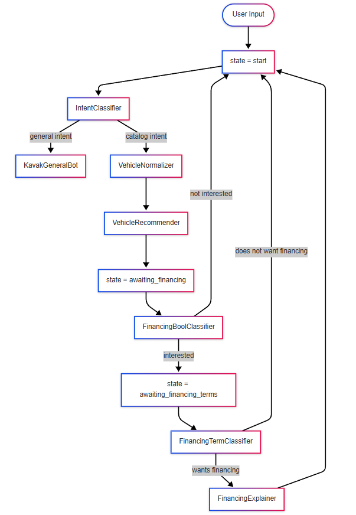

# AI Sales Agent API

Una API modular para asistentes conversacionales de ventas basados en modelos de lenguaje (LLM), diseñada para integrarse fácilmente con servicios como Twilio y adaptarse a múltiples casos de uso, incluyendo:

* Clasificación de vehículos
* Recomendación personalizada
* Normalización de datos
* Explicación de financiamiento

## 📦 Características principales

* Soporte para múltiples agentes configurables
* Separación clara entre lógica de agentes y API
* Compatibilidad con modelos como GPT y DeepSeek
* Estandarización de código con `black`, `isort` y `pre-commit`
* Docker-ready para despliegue rápido

## ⚙️ Instalación y configuración

### 1. Clona el repositorio

```bash
git clone https://github.com/oscrlpz/ai-sales-agent
cd ai-sales-agent
```

### 2. Crea y activa un entorno virtual (se recomienda `.venv`)

```bash
python -m venv .venv
source .venv/bin/activate  # En Windows: .venv\Scripts\activate
```

### 3. Instala las dependencias

* Para producción:

  ```bash
  pip install -r requirements.txt
  ```

* Para desarrollo (esto incluye solo las herramientas que no son necesarias para producción, como `black`, `isort`, `pre-commit`, `pytest` etc.):

  ```bash
  pip install -r requirements-dev.txt
  ```

## 🧹 Calidad del código

Este proyecto usa:

* [`black`](https://github.com/psf/black) para formateo automático
* [`isort`](https://github.com/PyCQA/isort) para orden de imports
* [`pre-commit`](https://pre-commit.com/) para garantizar formato consistente en cada commit

### Para activar los hooks de pre-commit:

```bash
pre-commit install
```

## 🗂️ Estructura del proyecto

```
proyecto/
├── .env
├── .venv/
│
├── agents/
│   ├── baseagent/          
│   │   ├── _basebot.py
│   │   ├── _classifier.py
│   │   ├── _normalizer.py
│   │   └── _recommender.py
│   ├── config/
│   │   ├── prompts/        
│   │   └── llm_models/     
│   ├── utils/              
│   ├── financing_explainer.py
│   ├── kavak_classifiers.py
│   ├── kavak_general.py
│   ├── vehicle_normalizer.py
│   └── vehicle_recommendation.py
│
├── api/
│   ├── routes/
│   │   └── webhook.py
│   ├── services/           
│   │   ├── whatsapp_service.py
│   │   └── sales_agent.py
│   └── main.py
│
├── tests/
│   ├── unit/
│   ├── integration/
│   └── e2e/
│
├── data/
│   ├── csv/
│   │   └── sample_caso_ai_engineer.csv
│   └── db/
│       └── chat_history.db
│
├── requirements.txt
└── requirements-dev.txt
```

- `agents/`: Contiene la lógica de los agentes, incluyendo clasificadores, normalizadores y recomendadores.
    - `baseagent/`: Implementaciones de los agentes base.
    - `config/`: Configuración de los modelos LLM y prompts específicos para cada agente.
    - `utils/`: Funciones auxiliares para la lógica de los agentes.
    - `financing_explainer.py`: Explicador de financiamiento.
    - `kavak_classifiers.py`: Clasificadores específicos para Kavak.
    - `kavak_general.py`: Lógica general para Kavak.
    - `vehicle_normalizer.py`: Normalizador de vehículos.
    - `vehicle_recommendation.py`: Recomendador de vehículos.
- `api/`: Contiene la API FastAPI, incluyendo las rutas y servicios.
    - `routes/`: Define las rutas de la API.
    - `services/`: Contiene la lógica de negocio desacoplada de los agentes. Se desacopla de las rutas para facilitar la reutilización y las pruebas.
- `tests/`: Contiene las pruebas unitarias, de integración y end-to-end.
- `data/`: Contiene los datos de ejemplo y la base de datos SQLite para el historial de chat.
    - `csv/`: Archivos CSV de ejemplo.
    - `db/`: Base de datos SQLite para el historial de chat.

## 🐳 Docker

### 1. Crear la imagen

```bash
docker build -t ai-sales-agent-api .
```

### 2. Configurar el archivo `.env`

Crea un archivo `.env` en la raíz del proyecto con las siguientes variables:

```
OPENAI_API_KEY=<OPENAI_API_KEY>
DEEPSEEK_API_KEY=<DEEPSEEK_API_KEY>
TWILIO_RECOVERY_CODE=<TWILIO_RECOVERY_CODE>
TWILIO_AUTH_TOKEN=<TWILIO_AUTH_TOKEN>
TWILIO_ACCOUNT_SID=<TWILIO_ACCOUNT_SID>
API_LLM_MODEL=gpt-3.5-turbo
CATALOG_PATH=data/csv/sample_caso_ai_engineer.csv
DB_PATH=data/db/chat_history.db

WORKERS=1
PORT=8000
```

### 3. Correr la imagen

```bash
docker run -p 8000:8000 --env-file .env ai-sales-agent-api
```

La API estará disponible en: [http://localhost:8000](http://localhost:8000)

## 🧠 Funcionamiento del agente de ventas

El agente conversacional sigue un flujo de control basado en estados y guarda el historial de conversación para mantener el contexto. Se apoya en distintos **sub-agentes especializados** que manejan tareas específicas como clasificación de intención, recomendación de vehículos, normalización de entradas, y explicación de planes de financiamiento.

### 🔁 Flujo general

1. **Carga de recursos**:

   * Se carga el catálogo de autos desde `data/csv/sample_caso_ai_engineer.csv`.
   * Se configura el modelo LLM a utilizar (por ejemplo, `gpt-3.5-turbo`).
   * Se recupera el historial de conversación desde `data/db/chat_history.db`.

2. **Inicialización de agentes**:

   * `IntentClassifier`: Detecta si el usuario quiere hablar de catálogo, generalidades o financiamiento.
   * `KavakGeneralBot`: Responde preguntas generales. La prompt se genera a partir de un scraper que va a la página de [Kavak](https://www.kavak.com/mx/blog/sedes-de-kavak-en-mexico) y obtiene información relevante.
   * `VehicleNormalizer`: Estandariza el input del usuario buscando extraer información relevante y evitando errores de ortografía, entradas ambiguas o mal escritas.
   * `VehicleRecommender`: Sugiere vehículos del catálogo basado en la solicitud del usuario normalizada.
   * `FinancingBoolClassifier`: Determina si el usuario quiere financiamiento, si o no.
   * `FinancingTermClassifier`: Extrae plazo y enganche que el usuario desea.
   * `FinancingExplainer`: Explica las condiciones del financiamiento.

| Estado                     | Acción principal                                   | Agente responsable                           | Siguiente estado                                                |
| -------------------------- | -------------------------------------------------- | -------------------------------------------- | --------------------------------------------------------------- |
| start                      | Clasificar intención del usuario                   | IntentClassifier                             | general → GeneralBot                                            |
|                            |                                                    |                                              | catalog → VehicleNormalizer + Recommender → awaiting\_financing |
| awaiting\_financing        | Preguntar interés en financiamiento                | FinancingBoolClassifier                      | sí → awaiting\_financing\_terms                                 |
|                            |                                                    |                                              | no → start                                                      |
| awaiting\_financing\_terms | Extraer términos de financiamiento y calcular plan | FinancingTermClassifier + FinancingExplainer | start                                                           |

Este flujo se detalla en el siguiente diagrama:



4. **Manejo del input del usuario**:

   * Se evalúa el estado anterior del usuario desde la conversación guardada.
   * Se actualiza el historial en la base de datos con el nuevo mensaje del usuario.

5. **Respuestas y guardado**:

   * La respuesta generada se guarda en la base de datos.
   * Se actualiza el estado para la siguiente interacción.

### 🗃️ Historial de conversación

Todas las interacciones se almacenan en una base SQLite (`chat_history.db`) a través de `ChatHistoryManager`. Se mantiene la conversación en contexto incluso si el usuario deja de interactuar y vuelve después. Esto permite que se pueda montar en sistemas distrubuidos ya que diferentes instancias del servicio pueden acceder a la misma base de datos compartida.
- Persistencia del estado entre sesiones.
- Escalabilidad: diferentes instancias del servicio (por ejemplo, en contenedores Docker o servicios de Cloud Run) pueden acceder a la misma base de datos compartida (por ejemplo, montada en disco compartido o convertida a PostgreSQL para producción).
- Tolerancia a fallos: si un contenedor se reinicia, no se pierde el contexto de la conversación?

## 🧩 Arquitectura e integración con WhatsApp vía Twilio

La solución está compuesta por tres componentes principales que trabajan juntos para habilitar una conversación automatizada a través de WhatsApp:

1. **Usuario en WhatsApp**: El punto de entrada es un mensaje enviado por el usuario a un número de WhatsApp que está vinculado a una cuenta de Twilio.

2. **Twilio como intermediario**: Twilio actúa como puente entre WhatsApp y nuestro sistema. Cada vez que un usuario envía un mensaje, Twilio lo captura y lo reenvía mediante una solicitud HTTP POST a un endpoint público que se haya configurado como *webhook* (en este caso, `/webhook/reply`).

3. **API del agente conversacional**:

   * El mensaje recibido es procesado por un endpoint implementado en FastAPI.
   * Se extrae el contenido del mensaje (`Body`) y el número del remitente (`From`).
   * Dependiendo del parámetro `test`, el mensaje puede procesarse de inmediato o como una tarea en segundo plano.
   * El módulo `sales_agent` utiliza un modelo de lenguaje natural para interpretar el mensaje, mantener el contexto de la conversación y generar una respuesta adecuada.
   * Finalmente, la API utiliza la biblioteca de Twilio para enviar la respuesta generada de vuelta al número de WhatsApp del usuario.

### 🔁 Flujo completo de mensajes

1. **Entrada**: Usuario escribe un mensaje por WhatsApp.
2. **Reenvío**: Twilio detecta el mensaje y lo envía al endpoint `/webhook/reply`.
3. **Procesamiento**:

   * El backend recibe el mensaje.
   * Se consulta al agente conversacional para generar una respuesta.
   * El contexto del usuario se conserva usando un identificador de sesión (`From`).
4. **Salida**: La respuesta se envía al usuario vía la API de Twilio.

Este diseño desacopla completamente la capa de mensajería (Twilio/WhatsApp) del motor conversacional, permitiendo flexibilidad, escalabilidad y fácil integración con otros canales en el futuro.

### 🧪 Pruebas locales del agente

Para probar el agente de ventas localmente, puedes correr el script `terminal_chat.py` que simula una conversación en la terminal. Este script permite interactuar con el agente de ventas sin necesidad de usar WhatsApp o Twilio.

Adicionalmente se tiene una prueba de integración que manda una serie de mensakes al agente e imprime en tiempo real como fluye la conversación. Para correr esta prueba, puedes usar el siguiente comando:

```bash
pytest -s tests/integration
```

La prueba simula todo el flujo donde un cliente pide información general de Kavak, pide recomendaciones de autos y pregunta por financiamiento. Finalmente el cliente regresa y pide infromación que previeamente ya había preguntado y el agente le recuerda la conversación previa.

Nota: Es necesario tener instalada la librería `pytest` para correr las pruebas. Esta se instala automáticamente al correr `pip install -r requirements-dev.txt`.

### ☁️ Opciones de despliegue: producción y pruebas locales

La API del agente conversacional está diseñada para ser fácilmente desplegable en diferentes entornos, gracias a su contenedor Docker. Hay dos escenarios comunes:

#### 1. **Despliegue en producción (por ejemplo, en Cloud Run)**

* La imagen Docker generada (`ai-sales-agent-api`) puede subirse a un registro de contenedores como Google Artifact Registry.
* Luego, se despliega como servicio en Google Cloud Run u otro orquestador compatible.
* Una vez desplegada, se configura la URL pública del servicio como el webhook en el panel de Twilio.
* Esto permite escalar automáticamente y mantener disponibilidad sin administrar servidores.

#### 2. **Pruebas locales con `ngrok`**

Para desarrollo o pruebas sin desplegar en la nube:

1. Corre la API localmente con Docker:

   ```bash
   docker run -p 8000:8000 --env-file .env ai-sales-agent-api
   ```

2. Abre un túnel público con `ngrok` hacia el puerto local:

   ```bash
   ngrok http 8000
   ```

3. Copia la URL generada por `ngrok` (por ejemplo, `https://6b95-189-146-136-90.ngrok-free.app`) y configúrala como webhook en Twilio (por ejemplo: `https://6b95-189-146-136-90.ngrok-free.app/webhook/reply`). A continuacion una imagen que muestra donde se configura el webhook en Twilio:

   

Esto te permite recibir mensajes reales de WhatsApp en tu entorno local sin necesidad de desplegar en la nube.

---